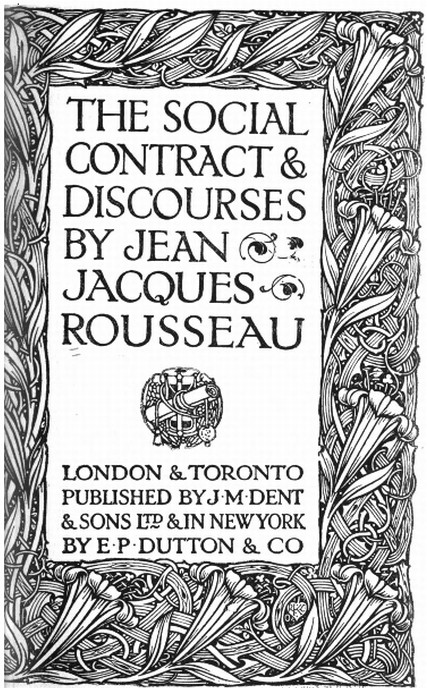

THE SOCIAL CONTRACT & DISCOURSES

BY

JEAN JACQUES ROUSSEAU

LONDON & TORONTO
PUBLISHED BY J. M. DENT & SONS
IN NEW YORK BY E. P. DUTTON & CO 1920

EVERYMAN'S LIBRARY

EDITED BY ERNEST RHYS
PHILOSOPHY AND THEOLOGY
ROUSSEAU'S SOCIAL CONTRACT, ETC.
TRANSLATED WITH INTRODUCTION
BY G. D. H. COLE, FELLOW OF MAGDALEN COLLEGE, OXFORD
